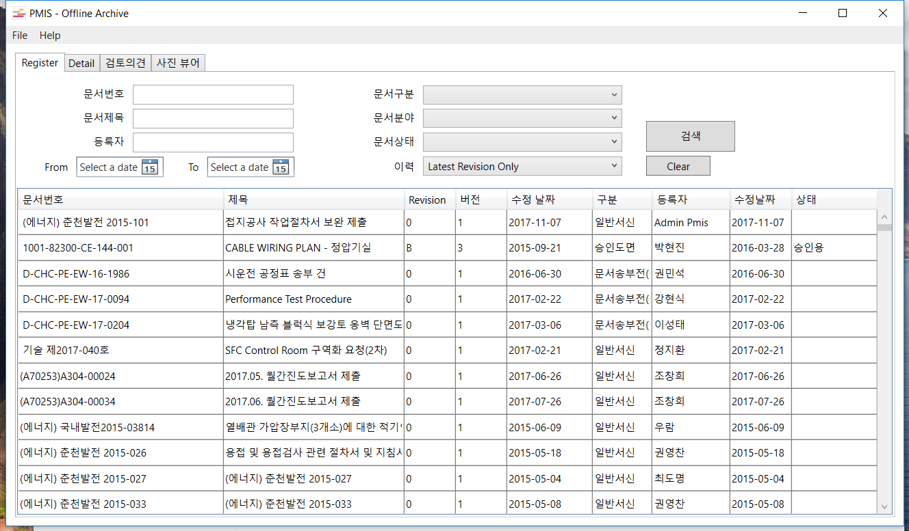
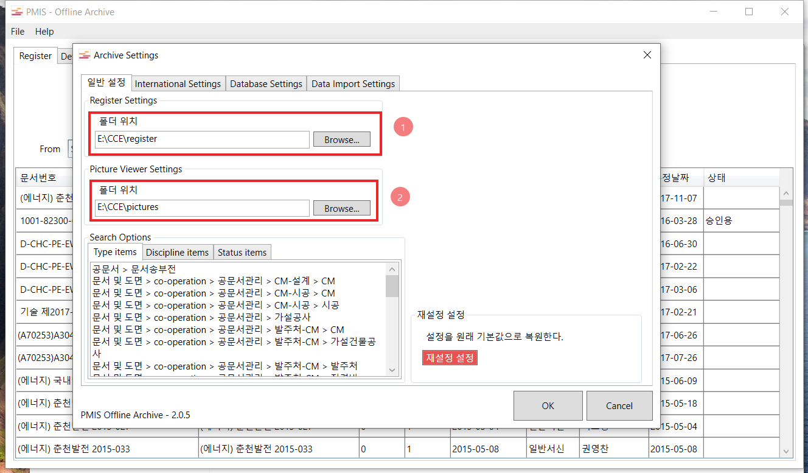
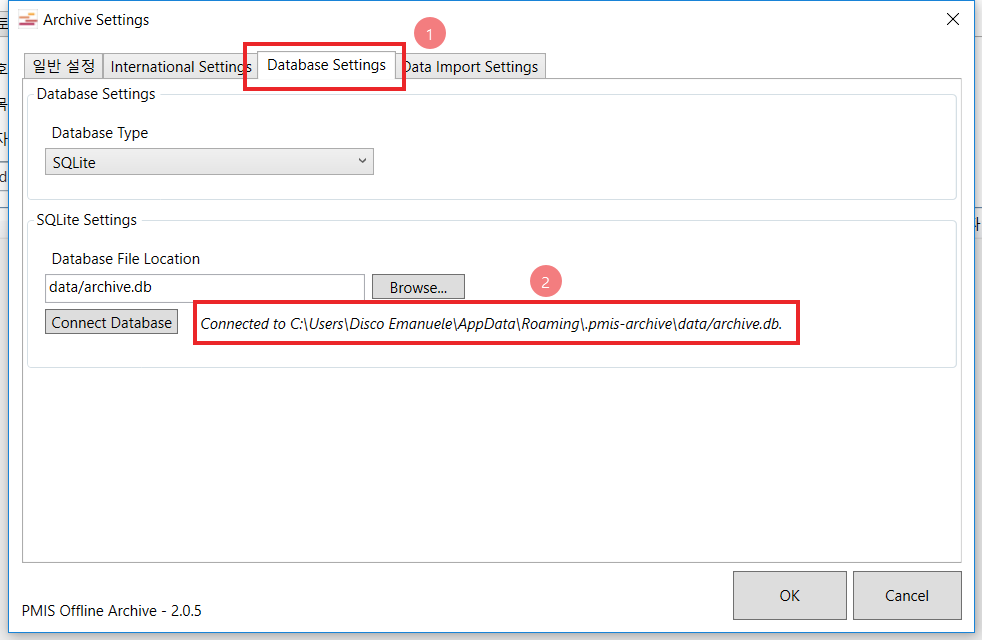
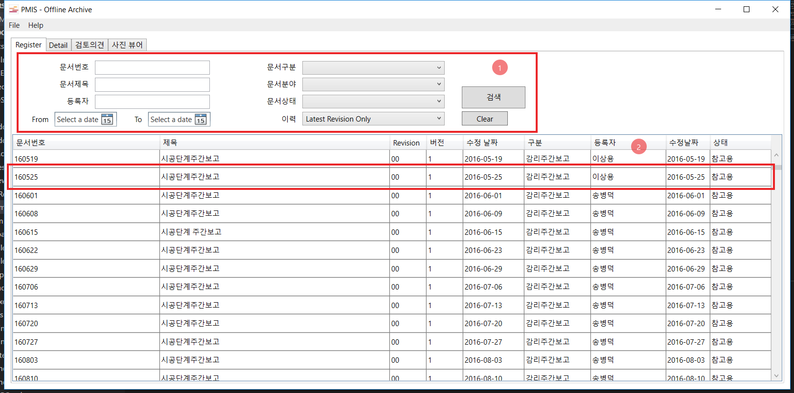
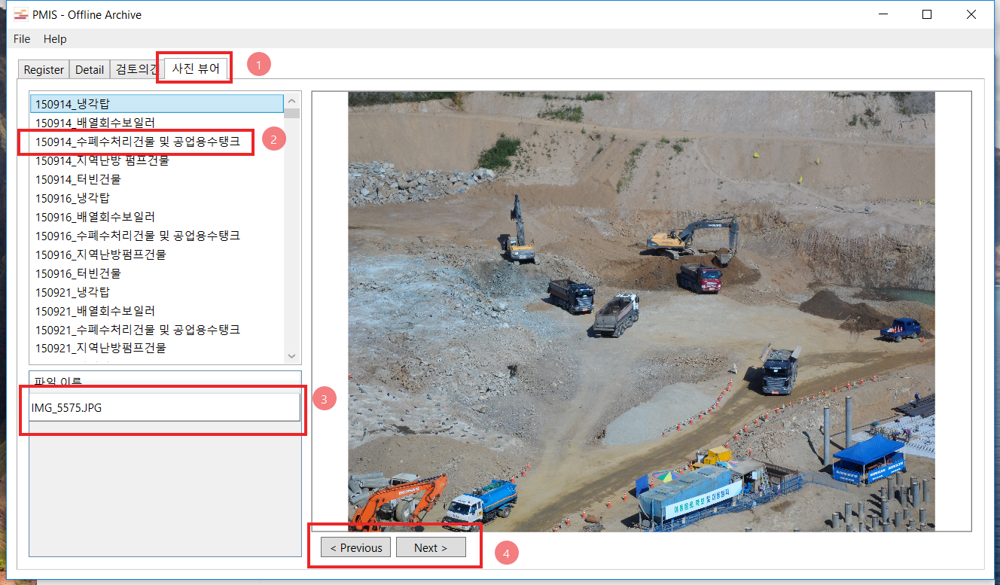

# Document Offline Archive for PMIS

## First Set Up

A first setting is required in order to use the archive provided.
We need to link the register and picture folder to the application.

From the main screen go to `File/Settings`.

---

Under `General Settings`, change the register folder and picture folder
accordingly (You should have received the storage with the register and picture folder).

---

Under `Database Settings` just make sure that the message say `Connected to ...archive.db`.
The `archive.db` is the default database provided and you don't need to change anything.

In case the message is different or the database is different contact the support team that will assist you to set the correct database.

---

If everything is set up correctly you can start using the archive.
After changing the database, if you don't see any data in the list you might need to click the Search button.

Search the documents you are looking for and double click on the result to open it.

---

## Picture Viewer

Choose a folder from the left list and pictures will show up on the bottom list. 
Than you can go through the all pictures of this folder using `Previous` and `Next` button or just clicking on the picture filename on the left bottom list.

## Versioning

We use *Hasta la vista, baby* for versioning, that means, we don't adopt any special versioning system.

<!-- ## Authors

* **Emanuele Disco** - [Emanuele Disco](https://github.com/PurpleBooth) -->

## License

This project is licensed under the Apache License - see the [LICENSE.md](LICENSE.md) file for details

## Credits

* Icons made by [Freepik](https://www.flaticon.com/authors/freepik) from www.flaticon.com
* Icons made by [Pixel Buddha](https://www.flaticon.com/authors/pixel-buddha) from www.flaticon.com
* Icons made by [Gregor Cresnar](https://www.flaticon.com/authors/gregor-cresnar) from www.flaticon.com

